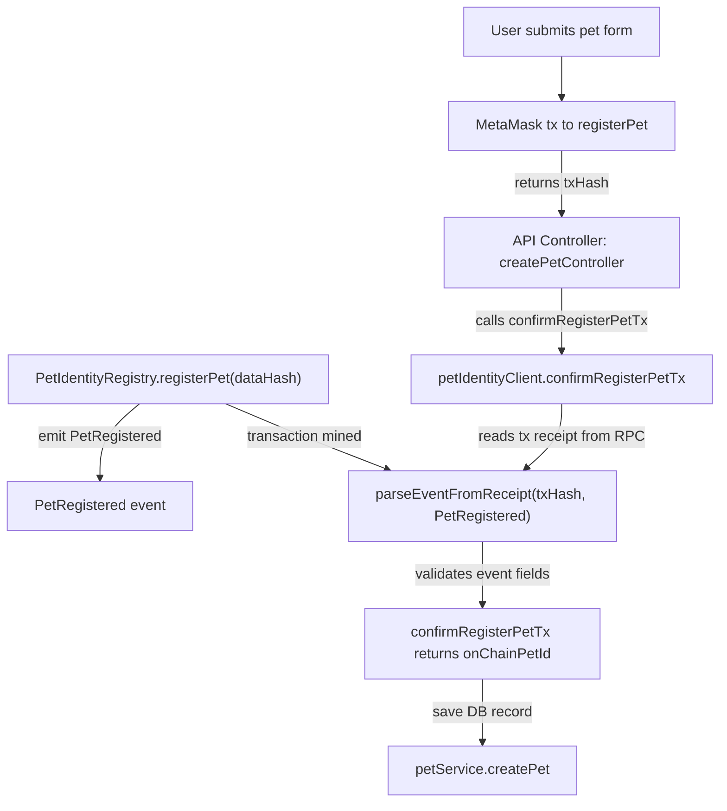

# PetRegistered Event Trace

This trace shows where the `PetRegistered` event is emitted and where the backend consumes it.

## Detailed trace

1. `PetIdentityRegistry.registerPet(bytes32 dataHash)` is called on-chain by the wallet owner.
2. The contract emits the `PetRegistered` event inside `registerPet`.
3. Frontend submits the transaction and receives a `txHash` from MetaMask.
4. Backend receives that `txHash` in `createPetController`.
5. `createPetController` calls `confirmRegisterPetTx(...)` in `backend/src/blockchain/petIdentityClient.ts`.
6. `confirmRegisterPetTx` calls `parseEventFromReceipt(txHash, "PetRegistered")` and validates:
   - the transaction sender matches the authenticated wallet
   - the returned `dataHash` matches the expected pet hash
7. If validation passes, backend persists the pet record in the database.

## Notes

- There is no separate on-chain event listener in the backend; the backend consumes the event by parsing the transaction receipt after the tx is mined.
- The event is used as proof that `registerPet` successfully executed and that the on-chain data matches the submitted payload.
